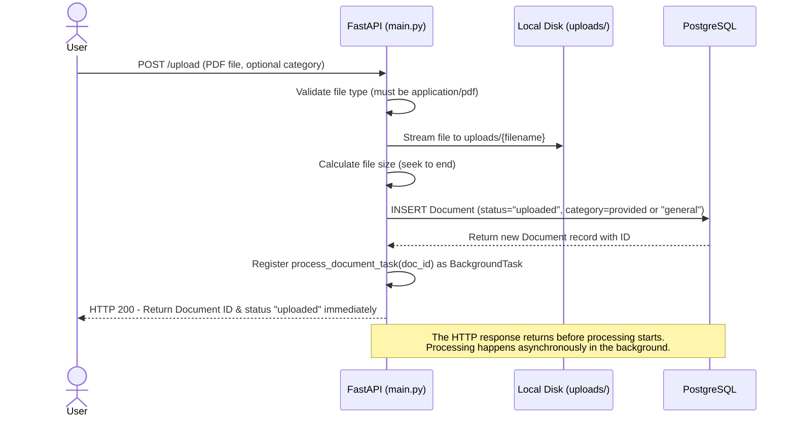
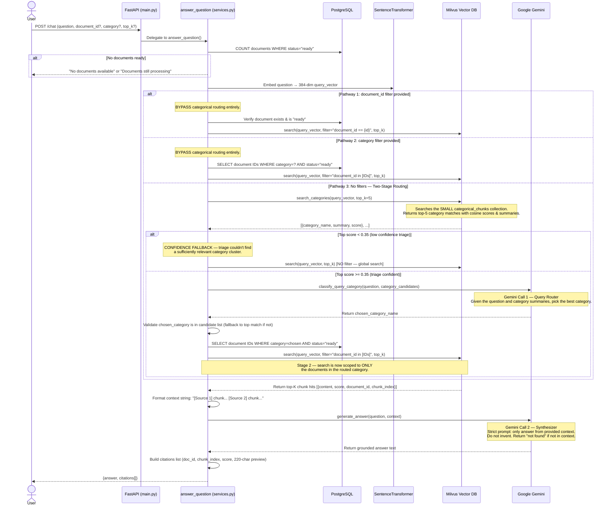

# CaRAG — Categorical Routing Augmented Generation

> A hierarchical, multi-LLM RAG backend that routes queries through semantically-clustered document categories before executing retrieval — reducing vector noise and dramatically improving answer precision at scale.

---

## 📌 Table of Contents

1. [Why CaRAG Exists — The Problem](#1-why-carag-exists--the-problem)
2. [What CaRAG Does — The Solution](#2-what-carag-does--the-solution)
3. [System Architecture Overview](#3-system-architecture-overview)
4. [Storage Layer Design](#4-storage-layer-design)
5. [Complete System Flow](#5-complete-system-flow)
   - [Phase 1: Document Upload](#phase-1-document-upload)
   - [Phase 2: Async Ingestion & Auto-Categorization](#phase-2-async-ingestion--auto-categorization)
   - [Phase 3: Two-Stage Query Routing & RAG](#phase-3-two-stage-query-routing--rag)
6. [The Multi-LLM Agentic Workflow](#6-the-multi-llm-agentic-workflow)
7. [Decision Thresholds & Parameters](#7-decision-thresholds--parameters)
8. [API Reference](#8-api-reference)
9. [Data Models](#9-data-models)
10. [Failure Modes & Mitigations](#10-failure-modes--mitigations)
11. [Repository Structure](#11-repository-structure)

---

## 1. Why CaRAG Exists — The Problem

A standard RAG (Retrieval-Augmented Generation) system works like this:

```
User asks question → Embed query → Search ALL document vectors → Pick top-K → Send to LLM → Answer
```

This works when you have a small, homogeneous document set. But as the corpus grows, it breaks down:

- **Vector Noise**: Searching across 10,000+ chunks from documents on wildly different topics returns semantically irrelevant chunks that confuse the LLM and dilute the answer quality.
- **Context Pollution**: An LLM prompt containing chunks from a legal document, a novel, and a financial report simultaneously cannot produce a focused, grounded answer.
- **Scalability Ceiling**: A single flat vector collection becomes expensive and slow as it grows, with no architectural mechanism to reduce search scope.

**The real problem is that traditional RAG has no concept of "which pile of documents is this question even about?"**

---

## 2. What CaRAG Does — The Solution

CaRAG introduces a **routing layer** that sits between the user query and the vector database. Before searching for specific text chunks, the system first determines *which category of documents* the question belongs to.

Think of it like a well-organized library:
- A librarian doesn't scan every single page of every book for your question.
- They first determine which *section* (Science, Fiction, Law) your question belongs to, then search only within that section.

CaRAG does the same thing, automatically and at speed, using:
1. **Categorical Cluster Summaries** — Live, LLM-generated summary embeddings for each document category stored in Milvus.
2. **Two-Stage Vector Search** — First against the small `categorical_chunks` collection (the library sections), then against the large but filtered `document_chunks` collection (the actual pages).
3. **An LLM Router** — A dedicated Gemini call that acts as an intelligent classifier, selecting the exact target category when vector triage alone isn't conclusive enough.

---

## 3. System Architecture Overview

```
┌────────────────────────────────────────────────────────────────────────┐
│                         CaRAG Backend System                           │
│                                                                        │
│  ┌──────────┐    ┌──────────────────┐    ┌───────────────────────┐    │
│  │  FastAPI │    │   PostgreSQL DB   │    │    Milvus Vector DB   │    │
│  │  (main)  │◄──►│  documents table  │    │                       │    │
│  │          │    │  chunks table     │    │  ┌─────────────────┐  │    │
│  └────┬─────┘    └──────────────────┘    │  │categorical_chunks│  │    │
│       │                                   │  │ (category embeddings)   │
│       │ Background                        │  └─────────────────┘  │    │
│       │ Task                              │  ┌─────────────────┐  │    │
│       ▼                                   │  │ document_chunks  │  │    │
│  ┌──────────┐    ┌──────────────────┐    │  │ (chunk embeddings)│ │    │
│  │services.py    │  Google Gemini   │    │  └─────────────────┘  │    │
│  │(pipeline)│◄──►│  (LLM calls)     │    └───────────────────────┘    │
│  │          │    │  - Classifier    │                                   │
│  │          │    │  - Router        │                                   │
│  │          │    │  - Synthesizer   │                                   │
│  └──────────┘    └──────────────────┘                                   │
└────────────────────────────────────────────────────────────────────────┘
```

### Tech Stack

| Component | Technology | Role |
|---|---|---|
| **API Framework** | FastAPI (Python) | Async HTTP routing, dependency injection |
| **Embeddings** | `sentence-transformers/all-MiniLM-L6-v2` | 384-dimensional dense vectors |
| **Vector DB** | Milvus | Stores and searches vector embeddings |
| **Relational DB** | PostgreSQL (SQLAlchemy ORM) | Metadata, IDs, statuses, category mappings |
| **LLM** | Google Gemini 2.5 Flash | Classification, routing, and answer synthesis |
| **Text Chunking** | LangChain `RecursiveCharacterTextSplitter` | Splits PDF text into contextual chunks |
| **PDF Parsing** | `pypdf` | Extracts raw text from uploaded PDFs |

---

## 4. Storage Layer Design

CaRAG uses a **hybrid storage model** — three distinct layers, each responsible for a specific type of data. This separation is intentional and architectural, not just for convenience.

### Layer 1: Local File Storage (`uploads/`)
- PDFs are streamed via `multipart/form-data` and written to the server's `uploads/` directory using Python's `shutil.copyfileobj`.
- The file path is stored in PostgreSQL so the system can re-access it if needed.
- This layer handles no intelligence — it is a raw binary store only.

### Layer 2: PostgreSQL — Relational Metadata Store

Two tables form the relational backbone:

**`documents` table**
| Column | Type | Description |
|---|---|---|
| `id` | Integer (PK) | Auto-incrementing, primary identifier |
| `filename` | String | Original uploaded file name |
| `file_path` | String | Path to the physical PDF on disk |
| `file_size` | Integer | File size in bytes |
| `status` | String | Lifecycle state: `uploaded` → `processing` → `ready` / `failed` |
| `category` | String | Assigned category (auto or manual). Defaults to `"general"` |
| `created_at` | DateTime | Timestamp of record creation |

**`document_chunks` table**
| Column | Type | Description |
|---|---|---|
| `id` | Integer (PK) | Auto-incrementing |
| `document_id` | Integer (FK) | References `documents.id` with `CASCADE` delete |
| `chunk_index` | Integer | The ordinal position of this chunk within the document |
| `content` | Text | The raw plaintext of this chunk |
| `milvus_id` | String | The corresponding Milvus record ID — the bridge between relational and vector storage |
| `created_at` | DateTime | Timestamp |

> **Why keep chunk content in Postgres AND Milvus?** Postgres stores the plaintext for debugging, citation text retrieval, and category summary generation. Milvus stores the vector representation for similarity search. They are complementary, not redundant.

### Layer 3: Milvus — Two-Collection Vector Store

This is the core architectural decision that makes CaRAG different from standard RAG.

**Collection 1: `document_chunks`**
- Contains one record per text chunk of every uploaded document.
- Schema: `id`, `vector` (384-dim), `document_id`, `chunk_index`, `content`
- Index: `AUTOINDEX` with `COSINE` metric
- Searched in Stage 2 of retrieval, always filtered by `document_id` or a list of `document_ids`

**Collection 2: `categorical_chunks`**
- Contains one record per **category**, not per document chunk.
- Schema: `id`, `vector` (384-dim), `category_name`, `summary`
- Stores a Gemini-generated 2-3 sentence summary of all documents belonging to that category, embedded as a single dense vector.
- Searched in Stage 1 of retrieval, against the entire collection (it's small and fast).
- **This collection is the brain of the routing system.** It answers the question: "which category of documents is this query closest to?"

---

## 5. Complete System Flow

### Phase 1: Document Upload



**Key Design Decision:** The HTTP response returns *immediately* with status `"uploaded"`. The user is not blocked waiting for vector embedding or LLM calls. The front-end polls `GET /documents` to track the lifecycle state.

---

### Phase 2: Async Ingestion & Auto-Categorization

This is the most complex flow in the system. After the HTTP response is returned, a background task (`process_document_task`) runs independently.

```mermaid
sequenceDiagram
    participant Worker as Background Task (services.py)
    participant DB as PostgreSQL
    participant Milvus as Milvus Vector DB
    participant Embedder as SentenceTransformer
    participant LLM as Google Gemini

    Worker->>DB: UPDATE status = "processing"
    Worker->>Worker: Extract full text (pypdf.PdfReader)
    Worker->>Worker: Split into chunks (RecursiveCharacterTextSplitter, size=800, overlap=120)

    rect rgb(30, 40, 55)
    Note over Worker,LLM: Auto-Categorization Block (only if no explicit category provided)
    Worker->>Embedder: Embed first chunk of document
    Worker->>Milvus: search_categories(first_chunk_vector, top_k=1)
    Milvus-->>Worker: Return best category match with cosine score

    alt Score >= 0.60 (high confidence vector match)
        Worker->>Worker: Assign matched category_name
        Note over Worker: No LLM call needed. Vector similarity is conclusive.
    else Score < 0.60 (no confident match)
        Worker->>DB: Query all existing distinct category names
        Worker->>LLM: classify_ingested_document(text_sample[:4000], existing_categories)
        Note over LLM: Gemini Call 0 — Document Classifier<br/>Picks from existing categories OR proposes a new one.
        LLM-->>Worker: Return category name string
        Worker->>Worker: Assign LLM-classified category
    end

    Worker->>DB: UPDATE document.category = resolved_category
    end

    Worker->>Embedder: Embed all chunks (batched)
    Worker->>Milvus: upsert_chunks(doc_id, chunks, embeddings)
    Note over Milvus: Assigns nanosecond-based IDs to prevent collisions.<br/>Calls flush() to seal segments for persistence.
    Milvus-->>Worker: Return list of Milvus IDs
    Worker->>DB: DELETE old chunk rows for this doc_id (idempotent re-processing)
    Worker->>DB: Bulk INSERT DocumentChunk rows with Milvus IDs
    Worker->>DB: UPDATE status = "ready"

    Worker->>Worker: asyncio.create_task(update_categorical_summary(category))
    Note over Worker,Milvus: Spawns another async background task<br/>to refresh the category's summary embedding.

    Worker->>DB: Query first chunk of every "ready" doc in this category
    Worker->>LLM: Generate unified 2-3 sentence category summary
    Note over LLM: Gemini Call — Category Summarizer<br/>Describes the collective scope of all docs in the category.
    LLM-->>Worker: Return summary text
    Worker->>Embedder: Embed summary text
    Worker->>Milvus: upsert_category_summary(category_name, summary, embedding)
    Note over Milvus: Deletes old summary for category first, then inserts new one.
```



---

### Phase 3: Two-Stage Query Routing & RAG

This is what makes CaRAG architecturally unique. The query pipeline has three possible execution pathways depending on what filters the user provides.



---

## 6. The Multi-LLM Agentic Workflow

CaRAG uses **three distinct Gemini calls**, each with a different persona and task. This is what constitutes the "agentic" aspect of the architecture:

| Call | When | Function | Persona | Input | Output |
|---|---|---|---|---|---|
| **Call 0** | During ingestion, if vector triage fails | `classify_ingested_document` | Document Classifier | First 4000 chars of document + existing category list | Single category name string |
| **Call 1** | During query, after Stage 1 triage | `classify_query_category` | Query Router | User question + top-5 category summaries + scores | Single category name string |
| **Call 2** | During query, after chunk retrieval | `generate_answer` | RAG Synthesizer | User question + top-K chunk context | Grounded natural language answer |

**Why three separate calls instead of one big prompt?**

Separation of concerns. A single monolithic prompt that classifies, routes, and synthesizes at once would:
- Be extremely large (expensive)
- Be harder to control (the model blends tasks)
- Make debugging nearly impossible (you can't tell which step failed)

Each call is narrowly scoped, has a single clear job, and produces a single clean output (always just a category name string or a text answer).

**Graceful Degradation (Rate Limit Handling):** All three LLM calls have explicit `429 / quota exhausted` detection. On failure, each falls back to a deterministic mock behavior (keyword matching for classifiers, raw chunk surfacing for the synthesizer) rather than crashing the system.

---

## 7. Decision Thresholds & Parameters

Every routing decision in CaRAG is governed by a numeric threshold. This section documents each one so the behavior is fully transparent.

| Threshold | Value | Location | What It Controls |
|---|---|---|---|
| **Category vector match (ingestion)** | `>= 0.60` | `services.py: process_document_task` | If the first chunk of a new document has cosine similarity ≥ 0.60 to an existing category summary, it is auto-assigned to that category without an LLM call. |
| **Category triage confidence (query)** | `>= 0.35` | `services.py: answer_question` | If the top categorical triage score is ≥ 0.35, the system proceeds to LLM-based routing. Below this, it falls back to a global search across all documents. |
| **Chunk size** | `800` chars | `config.py: CHUNK_SIZE` | Maximum character length of each text chunk from `RecursiveCharacterTextSplitter`. |
| **Chunk overlap** | `120` chars | `config.py: CHUNK_OVERLAP` | Character overlap between consecutive chunks to preserve sentence continuity across boundaries. |
| **Embedding dimension** | `384` | `config.py: EMBEDDING_DIM` | Dimensionality of vectors produced by `all-MiniLM-L6-v2`. Fixed at Milvus collection creation. |
| **Top-K retrieval** | `5` (default, max `10`) | `schemas.py: ChatRequest` | Number of top-scoring chunks to retrieve and inject into the LLM context. Capped at 10 to keep prompts manageable. |
| **Category search top-K** | `5` | `services.py` | Number of top category matches to retrieve in Stage 1 triage and pass to the LLM Router. |

---

## 8. API Reference

Base URL: `http://127.0.0.1:8000`
Interactive Docs: `http://127.0.0.1:8000/docs`

---

### Document Management

#### `POST /upload`
Upload a PDF. Triggers asynchronous ingestion. Returns immediately.

- **Content-Type:** `multipart/form-data`
- **Form Fields:**
  - `file` *(required)*: Binary PDF file. Must have `content_type = application/pdf`.
  - `category` *(optional, string)*: Explicitly assigns a category, bypassing auto-classification.

```json
// Response 200 OK
{
  "id": 3,
  "filename": "annual_report_2025.pdf",
  "status": "uploaded",
  "file_size": 2048500,
  "category": "Financial Reports"
}
```

> If `category` is omitted, the system defaults to `"general"` initially, then overwrites it during async processing via vector match or LLM classification.

---

#### `GET /documents`
List all documents tracked in the system with their current status.

```json
// Response 200 OK
[
  {
    "id": 1,
    "filename": "deep_learning_intro.pdf",
    "status": "ready",
    "file_size": 5120000,
    "category": "Machine Learning"
  },
  {
    "id": 2,
    "filename": "contract_2025.pdf",
    "status": "processing",
    "file_size": 102400,
    "category": "Legal"
  }
]
```

> **Status Lifecycle:** `uploaded` → `processing` → `ready` (or `failed` on error)

---

#### `GET /documents/{document_id}`
Retrieve a specific document's full metadata.

- **Path Param:** `document_id` (integer)
- **Response `404`** if document not found.

---

#### `PATCH /documents/{document_id}`
Admin override to manually update a document's status field. Useful for marking documents as `archived` or force-resetting a stuck `processing` state.

```json
// Request Body
{ "status": "archived" }

// Response 200 OK — full document object with updated status
```

---

#### `DELETE /documents/{document_id}`
Permanently deletes a document and all its associated data across all three storage layers:
1. Removes the physical file from `uploads/` on disk.
2. Deletes all vector records from Milvus `document_chunks` where `document_id == id`.
3. Deletes all relational chunk rows from PostgreSQL via `CASCADE`.
4. If the document's category now has zero remaining `ready` documents, drops that category's summary vector from `categorical_chunks`. Otherwise, regenerates the category summary in the background.

```json
// Response 200 OK
{ "message": "Document deleted", "id": 3 }
```

---

#### `DELETE /documents`
⚠️ **Factory Reset.** Completely wipes the entire system state:
1. Deletes every file inside `uploads/`.
2. Drops and recreates both Milvus collections from scratch.
3. Executes `TRUNCATE TABLE document_chunks, documents RESTART IDENTITY CASCADE` in PostgreSQL, resetting auto-increment IDs back to 1.

```json
// Response 200 OK
{
  "message": "System reset successful",
  "documents_deleted": 12,
  "chunks_deleted": 4350
}
```

---

### Chat & Retrieval

#### `POST /chat`
The primary RAG query endpoint. Accepts a natural language question and optional routing filters.

```json
// Request Body
{
  "question": "What were the key financial risks identified in Q3?",
  "document_id": null,
  "category": "Financial Reports",
  "top_k": 5
}
```

| Field | Type | Required | Description |
|---|---|---|---|
| `question` | string | ✅ | The natural language question to answer |
| `document_id` | integer | ❌ | If set, bypasses routing and searches only this document |
| `category` | string | ❌ | If set, bypasses LLM routing and searches only this category |
| `top_k` | integer | ❌ | Number of chunks to retrieve. Defaults to `5`, capped at `10` |

```json
// Response 200 OK
{
  "answer": "The Q3 report identified three key financial risks: ...",
  "citations": [
    {
      "document_id": 3,
      "chunk_index": 17,
      "score": 0.87,
      "content_preview": "Risk Factors Section: The primary concerns for Q3 include..."
    }
  ]
}
```

---

### Debug & Utility

#### `GET /ping`
Health check. Returns `{"status": "alive"}` with HTTP 200. Use this to verify the server is reachable.

#### `GET /debug/db`
Returns raw row counts from PostgreSQL. Useful for debugging synchronization issues between Postgres and Milvus.

```json
// Response 200 OK
{ "documents": 12, "chunks": 4350 }
```

#### `POST /clean-system`
Utility endpoint that triggers Python garbage collection and kills orphaned zombie `python.exe` processes on Windows (excluding the current server process). Useful during development when background tasks leave dangling processes.

---

## 9. Data Models

### Pydantic Schemas (`schemas.py`)

| Schema | Used For | Key Fields |
|---|---|---|
| `DocumentResponse` | All document endpoints | `id`, `filename`, `status`, `file_size`, `category` |
| `DocumentStatusUpdate` | `PATCH /documents/{id}` | `status` (string) |
| `ChatRequest` | `POST /chat` | `question`, `document_id?`, `category?`, `top_k=5` |
| `ChatCitation` | Inside `ChatResponse` | `document_id`, `chunk_index`, `score`, `content_preview` |
| `ChatResponse` | `POST /chat` | `answer`, `citations: list[ChatCitation]` |

All schemas use `ConfigDict(from_attributes=True)` where needed, enabling seamless conversion from SQLAlchemy ORM model instances to Pydantic response objects.

---

## 10. Failure Modes & Mitigations

| Failure Mode | Root Cause | Current Mitigation | Planned Enhancement |
|---|---|---|---|
| **Taxonomy Drift** | Auto-generation creates too many redundant categories (e.g., "Sci-Fi", "Science Fiction", "SciFi") | High cosine threshold (0.60) for vector-based category matching prevents near-duplicate categories from forming | Scheduled cron loop using LLM to inspect, reconcile, and merge adjacent summaries |
| **LLM Router Misclassification** | Gemini Call 1 picks the wrong category, routing the query to an irrelevant document set | Validation check: if Gemini returns a category not in the candidate list, fall back to the top vector-matched category | Reranking layer to re-evaluate chunk relevance after retrieval |
| **Stale Category Summaries** | A document added to a category doesn't update the summary, so the cluster's embedding drifts from its true content | `update_categorical_summary` is triggered as an async task every time a document reaches `"ready"` status | Event-driven invalidation queue for high-throughput ingestion scenarios |
| **Low Confidence Fallback Gap** | Score < 0.35 triggers global search, which may still return noisy results | Global search is a safe, recoverable fallback | Append a secondary confidence check on retrieved chunks before synthesis |
| **Gemini Rate Limiting** | API quota exhausted mid-flow | All three LLM calls have `429` detection and return graceful mock responses instead of 500 errors | Retry with exponential backoff + switchable LLM provider config |
| **Chunk Boundary Loss** | Text chunked at 800 chars may cut mid-sentence, losing semantic coherence | 120-char overlap helps preserve context across boundaries | Sentence-aware chunking using spaCy or semantic chunking |

---

## 11. Repository Structure

```
CaRAG/
├── README.md                    ← You are here. Full system architecture.
├── rag_pipeline_knowledge_base.md.pdf  ← Reference material used during design
│
├── backend/
│   ├── README.md                ← Code-level deep dive: functions, services, nuances
│   ├── src/
│   │   ├── main.py              ← FastAPI app, all route definitions
│   │   ├── services.py          ← Core business logic: ingestion, routing, RAG
│   │   ├── llm_service.py       ← All Gemini calls (classifier, router, synthesizer)
│   │   ├── milvus_store.py      ← Milvus wrapper: collections, upsert, search, delete
│   │   ├── models.py            ← SQLAlchemy ORM models (Document, DocumentChunk)
│   │   ├── schemas.py           ← Pydantic request/response schemas
│   │   ├── database.py          ← PostgreSQL engine setup and session factory
│   │   ├── config.py            ← Environment variable loading and constants
│   │   └── startupguide.md      ← Step-by-step local setup guide
│   ├── uploads/                 ← Uploaded PDF storage (runtime, gitignored)
│   └── venv/                    ← Python virtual environment (gitignored)
│
├── frontend/
│   └── ...                      ← React + Vite frontend client
│
└── labs/
    └── OOPS/                    ← Python OOP learning exercises (independent)
```