# Project Architecture & Detailed Workflows

This document serves as the comprehensive architectural reference for the Rapid Foundation Document RAG API. It maps out the end-to-end user flows, data flows, and details the endpoints available in the system.

---

## 🌊 1. User & System Flow

The primary lifecycle of a document in this system involves two distinct phases: **Asynchronous Ingestion** and **Retrieval-Augmented Chat**.

```mermaid
sequenceDiagram
    actor User
    participant API as FastAPI Server
    participant DB as PostgreSQL
    participant Worker as Background Task
    participant Milvus as Milvus Vector DB
    participant LLM as Google Gemini

    %% Phase 1: Upload
    User->>API: POST /upload (PDF file)
    API->>API: Save PDF to /uploads
    API->>DB: Save document metadata (status: "uploaded")
    API->>Worker: Spawn process_document_task(doc_id)
    API-->>User: Return Document ID & status ("uploaded")
    
    %% Phase 2: Async Processing
    rect rgb(23, 32, 42)
    Note over Worker, Milvus: Asynchronous Document Ingestion
    Worker->>DB: Update status to "processing"
    Worker->>Worker: Extract text (pypdf)
    Worker->>Worker: Chunk text (langchain RecursiveCharacterTextSplitter)
    Worker->>Worker: Generate Embeddings (Sentence-Transformers)
    Worker->>Milvus: Upsert chunk embeddings
    Worker->>DB: Save Chunk metadata & Milvus IDs
    Worker->>DB: Update status to "ready" (or "failed")
    end

    %% Phase 3: Chat/Query
    User->>API: POST /chat (question, document_id)
    API->>API: Embed question text
    API->>Milvus: Vector similarity search (top_k chunks)
    Milvus-->>API: Return highly relevant chunks
    API->>LLM: Send context (chunks) + question
    LLM-->>API: Formulate grounded answer
    API-->>User: Return Answer + Source Citations
```



---

## 💾 2. Data Flow Architecture

Our data pipeline segregates responsibilities across different specialized storage engines:

1. **File Storage Layer (Local Disk):**
   - PDFs are streamed via `multipart/form-data` and securely saved into the `uploads/` directory on the server.
2. **Relational Metadata Layer (PostgreSQL):**
   - **`documents` table:** Maintains file names, sizes, file paths, and processing states (`uploaded`, `processing`, `ready`, `failed`).
   - **`document_chunks` table:** Acts as a bridge, tracking which chunks belong to which document, their plaintext content, and their corresponding `milvus_id`.
3. **Vector Storage Layer (Milvus):**
   - Maintains the dense vector embeddings (`dimension = 384`). The chunks are mapped back to their originating document using custom metadata filters, enabling isolated per-document or global context searches.
4. **LLM Generation Layer (Gemini):**
   - Purely stateless. It consumes a dynamically constructed prompt containing only the chunks retrieved from Milvus. A strict system prompt forces the model to rely solely on the provided context.

---

## 🔌 3. Detailed API Specification

The API is mounted at `http://127.0.0.1:8000` by default.

### 📝 Document Management Endpoints

#### `POST /upload`
Upload a new PDF document into the system. Triggers asynchronous processing.
- **Content-Type:** `multipart/form-data`
- **Payload:** `file` (Binary PDF File)
- **Response `200 OK`**:
  ```json
  {
    "id": 1,
    "filename": "annual_report_2025.pdf",
    "status": "uploaded",
    "file_size": 2048500
  }
  ```

#### `GET /documents`
List all tracked documents in the system.
- **Response `200 OK`**: Array of document objects.
  ```json
  [
    {
      "id": 1,
      "filename": "annual_report_2025.pdf",
      "status": "ready",
      "file_size": 2048500
    }
  ]
  ```

#### `GET /documents/{document_id}`
Retrieve the metadata and processing status of a specific document.
- **Path Parameter:** `document_id` (integer)
- **Response `200 OK`**: Document object.
- **Response `404 Not Found`**: If the document doesn't exist.

#### `PATCH /documents/{document_id}`
Update the status of a specific document (primarily utilized for administrative overwrites or fixes).
- **Content-Type:** `application/json`
- **Payload**:
  ```json
  {
    "status": "archived"
  }
  ```

#### `DELETE /documents/{document_id}`
Permanently delete a document. This cascades and deletes the physical file from `/uploads`, vector chunks from Milvus, and relational metadata from PostgreSQL.
- **Response `200 OK`**:
  ```json
  {
    "message": "Document deleted",
    "id": 1
  }
  ```

#### `DELETE /documents`
**[DANGER]** Factory reset endpoint. Truncates all tables, purges all physical files from `/uploads`, drops the Milvus collection, and resets the auto-increment counters.
- **Response `200 OK`**:
  ```json
  {
    "message": "System reset successful",
    "documents_deleted": 5,
    "chunks_deleted": 1500
  }
  ```

---

### 💬 Chat & Retrieval Endpoints

#### `POST /chat`
Query the document knowledge base. You can query a specific document or query globally across all documents by omitting the `document_id`.
- **Content-Type:** `application/json`
- **Payload**:
  ```json
  {
    "question": "What is the total revenue for Q3?",
    "document_id": 1, 
    "top_k": 5
  }
  ```
  *(Note: `document_id` is optional. `top_k` defaults to 5 if omitted).*
- **Response `200 OK`**:
  ```json
  {
    "answer": "The total revenue for Q3 was $45.2 million, as outlined in the financial summary.",
    "citations": [
      {
        "document_id": 1,
        "chunk_index": 12,
        "score": 0.82,
        "content_preview": "Financial Summary: Q3 performance exceeded expectations with total revenue hitting $45.2 million..."
      }
    ]
  }
  ```

---

### 🛠️ Debug & Utility Endpoints

#### `GET /ping`
Health check endpoint.
- **Response `200 OK`**: `{"status": "alive"}`

#### `GET /debug/db`
Outputs raw counts from the relational database for debugging synchronization issues.
- **Response `200 OK`**:
  ```json
  {
    "documents": 12,
    "chunks": 4350
  }
  ```
