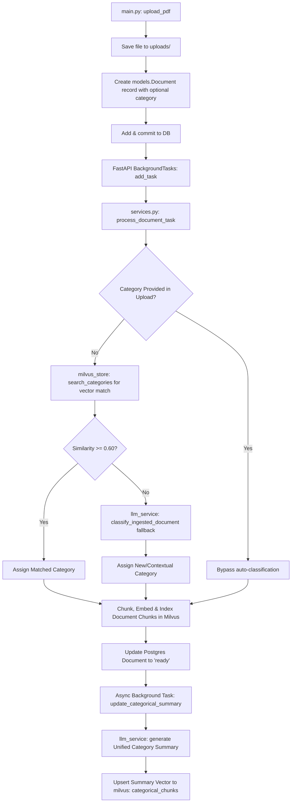
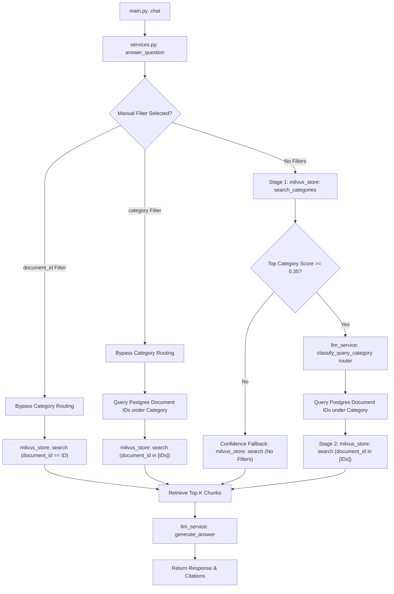

# Code-Level Backend Flow & Running Instructions (Optimized)

This document describes how to start the application components and details the exact calling flows, function sequences, and database transactions for each user interaction pathway on the backend of the JPL RAG Console after implementing the **Two-Stage Categorical Routing** phase.

---

## 🚀 How to Run the System Locally

To run both the backend API and frontend React application, execute the following steps in separate terminal shells. Ensure PostgreSQL and Milvus servers are running and reachable.

### 1. Backend Server Startup
Navigate to the backend directory, activate the Python virtual environment, and run the FastAPI server using Uvicorn:
```powershell
# Navigate to the backend directory
cd Project/backend

# Activate the virtual environment
.\venv\Scripts\activate

# Start the server (bind to 127.0.0.1 on port 8000)
python -m uvicorn src.main:app --host 127.0.0.1 --port 8000 --reload
```
*   **API Base URL**: `http://127.0.0.1:8000`
*   **FastAPI Interactive Swagger Docs**: `http://127.0.0.1:8000/docs`

### 2. Frontend React Client Startup
Navigate to the frontend directory, install dependency packages, and run the Vite development server:
```powershell
# Navigate to the frontend directory
cd Project/frontend

# Install dependencies (only required on first run)
npm install

# Start Vite development server
npm run dev
```
*   **Vite Dev Server URL**: Typically `http://localhost:5173` (Vite will print the active port in the console)

---

## 🛠️ System Flows & Code Pathways

## 1. Document Ingestion Pathway (`POST /upload`)

When a user selects or drops a PDF in the UI, the upload flow is triggered.



### Step-by-Step execution details:
1.  **FastAPI Route Entry**: The client calls `POST /upload` with the file multi-part data and an optional `category` Form parameter, handled by `upload_pdf` in [main.py](file:///e:/Codes/JPL/Task0_RapidFoundation/Project/backend/src/main.py#L35).
2.  **Physical File Storage**: The file stream is saved into the local `uploads/` folder using Python's `shutil.copyfileobj`.
3.  **Relational DB Insertion**: A new instance of `models.Document` is declared with status `"uploaded"` and the optional category (defaults to `"general"` if not supplied), saved, and committed using the SQLAlchemy session.
4.  **Asynchronous Ingestion Launch**: The endpoint registers a background task using FastAPI's `BackgroundTasks.add_task` invoking `services.process_document_task(new_doc.id, filename)`. The HTTP response returns `200 OK` with the record metadata to the client immediately.
5.  **Background Thread Ingestion** (`process_document_task` in [services.py](file:///e:/Codes/JPL/Task0_RapidFoundation/Project/backend/src/services.py#L132)):
    *   Opens an independent database session `sessionLocal()`.
    *   Changes the document status to `"processing"`.
    *   Extracts page-by-page text using `pypdf.PdfReader` and chunks it using `RecursiveCharacterTextSplitter`.
    *   **Dynamic Automated Categorization**:
        *   If the document category was **not** explicitly provided by the user (i.e. is `"general"` or `None`):
            1.  Embeds the first page chunk and queries the `categorical_chunks` collection via `milvus_store.search_categories`.
            2.  If the top category similarity is $\ge 0.60$, the document is assigned to that category.
            3.  Otherwise, it queries existing categories in Postgres and calls `llm_service.classify_ingested_document` as a fallback. Gemini inspects the header text and selects the best matching category or proposes a new category name.
        *   Saves the resolved category to the `Document` model in PostgreSQL.
    *   Embeds document chunks and invokes `milvus_store.upsert_chunks` to insert them into `document_chunks`.
    *   Deletes any existing chunks for this document in Postgres and bulk saves new instances of `models.DocumentChunk` referencing the document ID and Milvus ID.
    *   Updates the document status to `"ready"` and commits the transaction.
    *   If a category is assigned (and is not `"general"`), it spawns a background `asyncio.create_task` to run `update_categorical_summary(category_name)`.
6.  **Async Summary Generation** (`update_categorical_summary` in [services.py](file:///e:/Codes/JPL/Task0_RapidFoundation/Project/backend/src/services.py#L71)):
    *   Queries PostgreSQL for all ready documents belonging to the category.
    *   Compiles a text context using the first chunk of each document.
    *   Asks Gemini to generate a unified 2-3 sentence summary describing the scope and topics of this category.
    *   Embeds this summary vector and upserts it into the `categorical_chunks` collection via `milvus_store.upsert_category_summary`.

---

## 2. Document Status Directory Listing (`GET /documents`)

The frontend polls this endpoint to update document statuses and display the list.

1.  **FastAPI Route Entry**: The client calls `GET /documents`, handled by `get_documents` in [main.py](file:///e:/Codes/JPL/Task0_RapidFoundation/Project/backend/src/main.py#L73).
2.  **Relational Lookup**: The route queries the Postgres database for all `models.Document` records: `db.query(models.Document).all()`.
3.  **Response Construction**: Formats the list using the `DocumentResponse` schema, including the document `category` string. If file size was not persisted, it calculates it dynamically using `os.path.getsize(doc.file_path)`.

---

## 3. Query Scoping and RAG generation (`POST /chat`)

Executed when the user types a question in the chat bar.



### Step-by-Step execution details:
1.  **FastAPI Route Entry**: The client submits a `ChatRequest` (containing `question`, optional `document_id` filter, optional `category` filter, and `top_k`) to `POST /chat` in [main.py](file:///e:/Codes/JPL/Task0_RapidFoundation/Project/backend/src/main.py#L132).
2.  **RAG Engine Logic** (`answer_question` in [services.py](file:///e:/Codes/JPL/Task0_RapidFoundation/Project/backend/src/services.py#L226)):
    *   **Availability Check**: Verifies that at least one document is ready. If zero, it returns an early message and skips retrieval.
    *   Embeds the question into a 384-dimension vector.
    *   **Pathway 1: Single Document Scoping**: If `document_id` is supplied:
        - Bypasses Stage 1.
        - Directly calls `milvus_store.search` passing `document_id` to filter vectors to that file.
    *   **Pathway 2: Workspace Category Scoping**: If `category` is explicitly supplied:
        - Bypasses Stage 1.
        - Queries PostgreSQL for all ready document IDs belonging to that category.
        - Calls `milvus_store.search` passing the list of document IDs (`document_ids` filter).
    *   **Pathway 3: Two-Stage Routing (No Filters)**: If no manual filters are active:
        - **Stage 1 (Categorical Triage)**: Calls `milvus_store.search_categories` to search the `categorical_chunks` collection.
        - **Confidence Fallback**: If no categories exist or the top category score is $< 0.35$, it falls back to a global search, calling `milvus_store.search` without any document ID filters.
        - **LLM Routing**: If the score is $\ge 0.35$, it invokes `llm_service.classify_query_category` passing the matched candidate categories and summaries. Gemini (**LLM router call**) selects the exact target category.
        - **Stage 2 (Local Search)**: Queries Postgres for ready document IDs in the chosen category and performs a Milvus search on `document_chunks` filtered by those document IDs.
3.  **Answer Synthesis**: The retrieved chunks are formatted into a prompt context and passed to `llm_service.generate_answer` (**LLM synthesizer call**) to produce a grounded text response.
4.  **Response Construction**: Returns the synthesized answer along with citations (referencing document ID, chunk index, score, and text previews).

---

## 4. Single Document Deletion (`DELETE /documents/{document_id}`)

Fires when a user clicks the trash icon on a document in the sidebar.

1.  **FastAPI Route Entry**: The client calls `DELETE /documents/{document_id}` in [main.py](file:///e:/Codes/JPL/Task0_RapidFoundation/Project/backend/src/main.py#L120).
2.  **Asset Cleanup**: Invokes `services.delete_document_assets(document_id, file_path)`.
    *   Removes the physical file from the `uploads/` directory if present.
    *   Invokes `milvus_store.delete_document_chunks(document_id)` to delete vectors matching the document ID.
3.  **Relational Database Cleanup**: Calls `db.delete(doc)` on the database session. Cascades delete-orphan triggers automatically remove matching relational metadata entries in `document_chunks` table, then commits the transaction.
4.  **Categorical Summary Invalidation**: 
    - Checks if any other ready documents remain in the deleted document's category.
    - If no documents remain, it calls `milvus_store.delete_category_summary(category_name)` to remove the category summary from the `categorical_chunks` collection.
    - Otherwise, it triggers `services.update_categorical_summary(category_name)` in the background to recalculate the unified summary.

---

## 5. System Reset Console (`DELETE /documents`)

Wipes the slate clean for database rows, physical files, and vector indices.

1.  **FastAPI Route Entry**: The client calls `DELETE /documents` in [main.py](file:///e:/Codes/JPL/Task0_RapidFoundation/Project/backend/src/main.py#L144).
2.  **System Wiping** (`reset_system` in [services.py](file:///e:/Codes/JPL/Task0_RapidFoundation/Project/backend/src/services.py#L314)):
    *   Removes all physical files inside `uploads/` using `os.remove`.
    *   Invokes `milvus_store.delete_all_chunks()`, which drops both `document_chunks` and `categorical_chunks` collections and recreates them fresh.
    *   Executes an atomic Postgres query:
        ```sql
        TRUNCATE TABLE document_chunks, documents RESTART IDENTITY CASCADE
        ```
        This completely empties both relational tables and resets auto-incrementing primary key ID sequences back to `1`.
3.  **Relational Database Commit**: Commits the transaction and returns the counts of deleted resources to the frontend.
