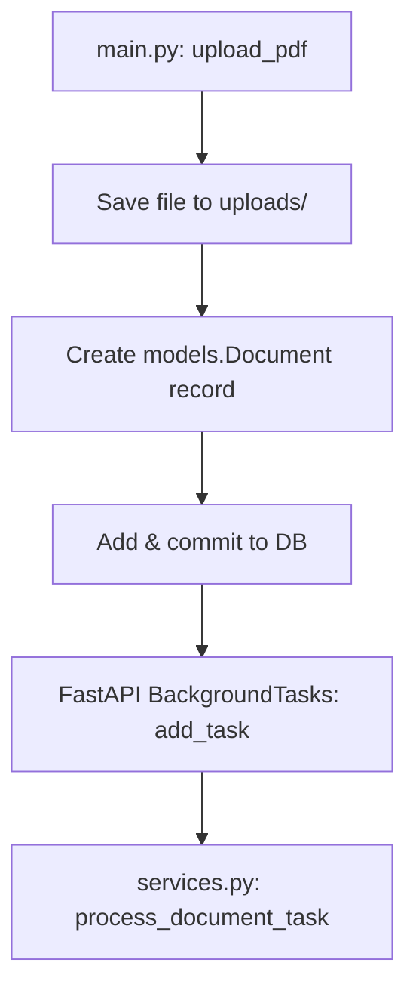
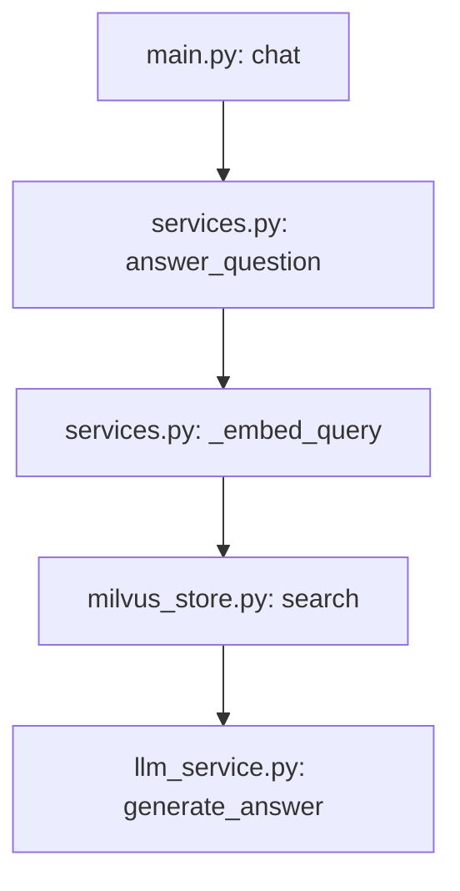

# Code-Level Backend Flow & Running Instructions

This document describes how to start the application components and details the exact calling flows, function sequences, and database transactions for each user interaction pathway on the backend of the JPL RAG Console.

---

## 🚀 How to Run the System Locally

To run both the backend API and frontend React application, execute the following steps in separate terminal shells. Ensure PostgreSQL and Milvus servers are running and reachable.

### 1. Backend Server Startup
Navigate to the backend directory, activate the Python virtual environment, and run the FastAPI server using Uvicorn:
```powershell
# Navigate to the backend directory
cd Project/backend

# Activate the virtual environment
.\venv\Scripts\activate

# Start the server (bind to 127.0.0.1 on port 8000)
python -m uvicorn src.main:app --host 127.0.0.1 --port 8000 --reload
```
*   **API Base URL**: `http://127.0.0.1:8000`
*   **FastAPI Interactive Swagger Docs**: `http://127.0.0.1:8000/docs`

### 2. Frontend React Client Startup
Navigate to the frontend directory, install dependency packages, and run the Vite development server:
```powershell
# Navigate to the frontend directory
cd Project/frontend

# Install dependencies (only required on first run)
npm install

# Start Vite development server
npm run dev
```
*   **Vite Dev Server URL**: Typically `http://localhost:5173` (Vite will print the active port in the console)

---

## 🛠️ System Flows & Code Pathways

## 1. Document Ingestion Pathway (`POST /upload`)

When a user selects or drops a PDF in the UI, the upload flow is triggered.



### Step-by-Step execution details:
1.  **FastAPI Route Entry**: The client calls `POST /upload` with the file multi-part data, intercepted by `upload_pdf` in [main.py](file:///e:/Codes/JPL/Task0_RapidFoundation/Project/backend/src/main.py#L26).
2.  **Physical File Storage**: The file stream is saved into the local `uploads/` folder using Python's `shutil.copyfileobj`.
3.  **Relational DB Insertion**: A new instance of `models.Document` is declared with status `"uploaded"`, saved, and committed using the SQLAlchemy session.
4.  **Asynchronous Ingestion Launch**: The endpoint registers a background task using FastAPI's `BackgroundTasks.add_task` invoking `services.process_document_task(new_doc.id, filename)`. The HTTP response returns `200 OK` with the record metadata to the client immediately.
5.  **Background Thread Execution** (`process_document_task` in [services.py](file:///e:/Codes/JPL/Task0_RapidFoundation/Project/backend/src/services.py#L71)):
    *   Opens an independent database session `sessionLocal()`.
    *   Changes the document status to `"processing"`.
    *   Calls `_extract_text_from_pdf` using `pypdf.PdfReader` to extract page-by-page text.
    *   Calls `_chunk_text` which initializes a `RecursiveCharacterTextSplitter` (splits by `\n\n`, `\n`, `. `, and ` ` based on `CHUNK_SIZE` and `CHUNK_OVERLAP` env variables).
    *   Calls `_embed_texts` using a singleton instance of `SentenceTransformer` (`sentence-transformers/all-MiniLM-L6-v2`) to generate 384-dimension vector embeddings.
    *   Invokes `milvus_store.upsert_chunks(document_id, chunks, embeddings)`. Inside [milvus_store.py](file:///e:/Codes/JPL/Task0_RapidFoundation/Project/backend/src/milvus_store.py#L94), the Milvus client ensures the collection exists, inserts the payload (auto-generating primary keys based on nanosecond timestamps), and runs `client.flush()` to seal segments.
    *   Deletes any existing chunks for this document in Postgres and bulk saves new instances of `models.DocumentChunk` referencing the document ID and Milvus ID.
    *   Updates the document status to `"ready"`.
    *   Closes the DB session.

---

## 2. Document Status Directory Listing (`GET /documents`)

The frontend polls this endpoint to update document statuses and display the list.

1.  **FastAPI Route Entry**: The client calls `GET /documents`, handled by `get_documents` in [main.py](file:///e:/Codes/JPL/Task0_RapidFoundation/Project/backend/src/main.py#L64).
2.  **Relational Lookup**: The route queries the Postgres database for all `models.Document` records: `db.query(models.Document).all()`.
3.  **Response Construction**: Formats the list using the `DocumentResponse` schema. If file size was not persisted, it calculates it dynamically using `os.path.getsize(doc.file_path)`.

---

## 3. Query Scoping and RAG generation (`POST /chat`)

Executed when the user types a question in the chat bar.



### Step-by-Step execution details:
1.  **FastAPI Route Entry**: The client submits a `ChatRequest` (question, optional document ID filter, and top-k) to `POST /chat` in [main.py](file:///e:/Codes/JPL/Task0_RapidFoundation/Project/backend/src/main.py#L123).
2.  **Grounded Logic Execution** (`answer_question` in [services.py](file:///e:/Codes/JPL/Task0_RapidFoundation/Project/backend/src/services.py#L127)):
    *   **New Edge Case Validation**: Checks if there are any documents in state `"ready"`. If none, it immediately returns a notice to the client without calling Milvus or Gemini.
    *   Calls `_embed_query` to encode the query string into a 384-dimension vector.
    *   Calls `milvus_store.search` in [milvus_store.py](file:///e:/Codes/JPL/Task0_RapidFoundation/Project/backend/src/milvus_store.py#L125).
    *   If a `document_id` was provided, Milvus applies a boolean filter expression: `filter="document_id == {document_id}"` during index traversal.
    *   Calculates similarity distances (using COSINE metric) and maps the top hits back to clean dictionaries (Milvus ID, score, document ID, page index, and content).
    *   Constructs citation records and merges context strings.
    *   Calls `generate_answer` in [llm_service.py](file:///e:/Codes/JPL/Task0_RapidFoundation/Project/backend/src/llm_service.py#L15), which compiles the user prompt with the retrieved context and sends the request to the Google Gemini API (`gemini-2.5-flash` model).
    *   Returns the resulting grounded text response and formatted sources metadata back to the client.

---

## 4. Single Document Deletion (`DELETE /documents/{document_id}`)

Fires when a user clicks the trash icon on a document in the sidebar.

1.  **FastAPI Route Entry**: The client calls `DELETE /documents/{document_id}` in [main.py](file:///e:/Codes/JPL/Task0_RapidFoundation/Project/backend/src/main.py#L111).
2.  **Asset Cleanup**: Invokes `services.delete_document_assets(document_id, file_path)`.
    *   Removes the physical file from the `uploads/` directory if present.
    *   Invokes `milvus_store.delete_document_chunks(document_id)` in [milvus_store.py](file:///e:/Codes/JPL/Task0_RapidFoundation/Project/backend/src/milvus_store.py#L153), executing a vector deletion expression matching the document ID.
3.  **Relational Database Cleanup**: Calls `db.delete(doc)` on the database session. Cascades delete-orphan triggers automatically remove matching relational metadata entries in `document_chunks` table, then commits the transaction.

---

## 5. System Reset Console (`DELETE /documents`)

Wipes the slate clean for database rows, physical files, and vector indices.

1.  **FastAPI Route Entry**: The client calls `DELETE /documents` in [main.py](file:///e:/Codes/JPL/Task0_RapidFoundation/Project/backend/src/main.py#L135).
2.  **System Wiping** (`reset_system` in [services.py](file:///e:/Codes/JPL/Task0_RapidFoundation/Project/backend/src/services.py#L184)):
    *   Removes all physical files inside `uploads/` using `os.remove`.
    *   Invokes `milvus_store.delete_all_chunks()` in [milvus_store.py](file:///e:/Codes/JPL/Task0_RapidFoundation/Project/backend/src/milvus_store.py#L173), which drops the Milvus collection (`client.drop_collection`) and recreates it fresh with proper indexing parameters.
    *   Executes an atomic Postgres query:
        ```sql
        TRUNCATE TABLE document_chunks, documents RESTART IDENTITY CASCADE
        ```
        This completely empties both relational tables and resets auto-incrementing primary key ID sequences back to `1`.
3.  **Relational Database Commit**: Commits the transaction and returns the counts of deleted resources to the frontend.
